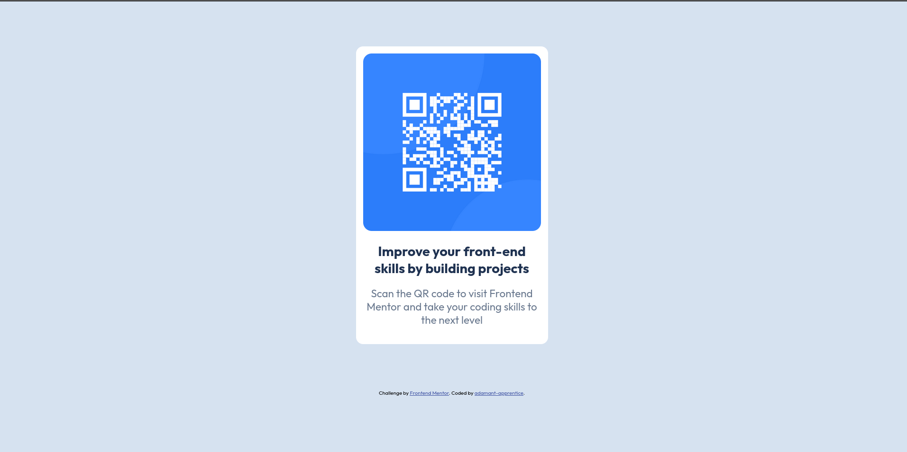
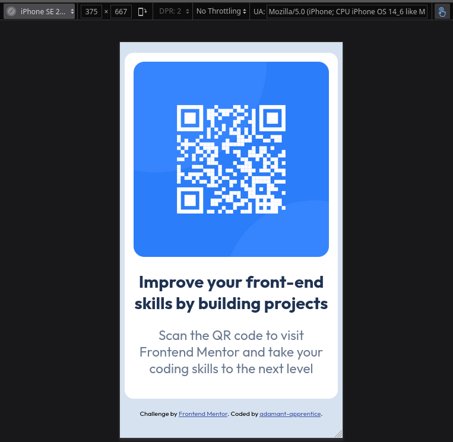

# Frontend Mentor - QR code component solution

This is a solution to the [QR code component challenge on Frontend Mentor](https://www.frontendmentor.io/challenges/qr-code-component-iux_sIO_H). Frontend Mentor challenges help you improve your coding skills by building realistic projects. 

## Table of contents

- [Overview](#overview)
  - [Screenshot](#screenshot)
- [My process](#my-process)
  - [Built with](#built-with)
  - [Useful resources](#useful-resources)
- [Author](#author)

## Overview

The goal of this challenge was to recreate a QR code card given in the preview with a title and description. Initially, it was challenging to understand the layout and structure, but once I identified the core elements and CSS properties needed, I was able to build the project.

### HTML Structure
For the HTML, I used a few fundamental elements:
- `div`: to serve as the main container for the content
- `img`: to display the QR code
- `h1`: for the title
- `p`: for the description

### CSS Properties
To style the QR code card, I used the following CSS properties:
- **font-family**: to set the appropriate font
- **background-color**: to establish a suitable background for the card
- **box-sizing**: set to `border-box` to handle padding and borders more effectively
- **max-width**: to limit the width and make the design responsive
- **border-radius**: to give the card and image rounded corners
- **margin**: to center the card on the page
- **padding**: to create space within the card's borders
- **text-align**: to center-align the text
- **object-fit**: to ensure the image fits well within its container
- **color**: to set the font color
- **font-size**: to control text size
- **font-weight**: to adjust the text’s boldness

This project helped me practice both HTML structure and foundational CSS properties, allowing me to build a simple but effective layout.

### Screenshot

## My process

For my design, I started by focusing on structuring the core elements, similar to building a house. Just as a solid foundation is essential before styling, I began by setting up the structural elements in HTML before moving on to CSS styling.

### HTML Structure  
I used a `div` with a class `.wrapper` to serve as the main container for my content. Inside this `div`, I organized three key elements:
   - An `img` element to display the QR code.
   - An `h1` element for the title.
   - A `p` element for the description text.

I avoided altering the pre-built template provided by Frontend Mentor, opting to keep the footer section as it was.

### Styling the Design  
Once the structure was in place, I moved on to styling, which proved to be the most challenging part. I referenced resources like [Google](https://www.google.com/), [MDN Web Docs](https://developer.mozilla.org/en-US/), and [ChatGPT](https://openai.com/chatgpt/overview/) to guide my decisions.

### Body Styles  
   - **Fonts**: Imported fonts from [Google Fonts](https://fonts.google.com/) by following their instructions.
   - **Background Color**: Set the background color as specified in the style guide.
   - **Box Sizing**: Added `box-sizing: border-box;` based on ChatGPT’s suggestion, which helped prevent content overflow when padding was applied.

### Wrapper Styles  
   - **Background Color**: Added a background color to the `.wrapper` to make its boundaries more distinct.
   - **Width and Responsiveness**: Set a `max-width` based on the style guide to ensure the design fit within mobile viewports.
   - **Border Radius**: Used `border-radius` to soften the edges, aligning with the preview’s rounded look.
   - **Padding**: Added padding to keep content from touching the container’s edges.
   - **Centering**: Centered the container using `margin: 5% auto;`, which was a challenge until I found the solution through a Google search.

### Image Styles  
   - **Object Fit**: The image initially overflowed, so I used `object-fit: contain;` and set a responsive `width` using percentages to make it scale smoothly on different screen sizes.
   - **Border Radius**: Matched the `border-radius` of the image to the wrapper to maintain visual consistency.

### Title & Description Styles  
   - **Color and Font Weight**: Selected the correct color and font weight to match the preview.
   - **Font Size**: Adjusted the font sizes by small increments until both the `h1` and `p` closely resembled the preview’s appearance.

### Built with

- Semantic HTML5 markup
- CSS custom properties

### Useful resources

- [ChatGPT](https://chatgpt.com/) - This helped me for XYZ reason. I really liked this pattern and will use it going forward.
- [MDN Web Docs](https://developer.mozilla.org/en-US/) - This is an amazing article which helped me finally understand XYZ. I'd recommend it to anyone still learning this concept.
- [google](https://www.google.com)
- [Kevin Powell - YT Channel](https://www.youtube.com/@KevinPowell)

## Author

- Frontend Mentor - [@adamant-apprentice](https://www.frontendmentor.io/profile/adamant-apprentice)